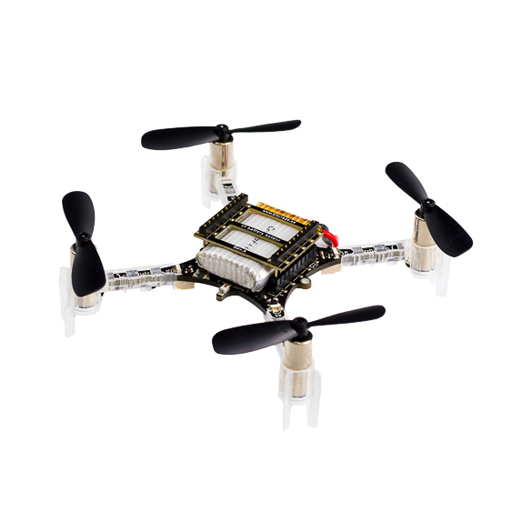

::: {.hero-section}

# Planner and Controller Co-Design for Crazyflie Gate Flight {.title}

::: {.subtitle}
Fast gate traversal with custom trajectory generation and tracking control
:::

::: {.author-list}

[**<span>Eshika Pathak</span>**](#)^1^,
[**<span>Xiang Li</span>**](#)^1^,
[**<span>Ziyu Zhao</span>**](#)^1^

:::

::: {.affiliation-list}

^1^ECE 484, University of Illinois Urbana-Champaign

:::

::: {.button-row}

[[ Demo Video]{.btn-text}](https://youtu.be/ABJNqoz1Dns){.btn .btn-primary}
[[ Code]{.btn-text}](https://github.com/safeautonomy-illinois-students/project-site-zzxe){.btn .btn-primary}
[[ Project Repo]{.btn-text}](https://github.com/safeautonomy-illinois-students/project-site-zzxe){.btn .btn-primary}

:::

:::


::: {.section-container}

::: {.hero-teaser}

{.teaser-img width="40%"}

*Image source: [Bitcraze Crazyflie 2.0](https://www.bitcraze.io/products/old-products/crazyflie-2-0/)*

:::

:::


::: {.section-container}

## Abstract {.section-title}

::: {.abstract-text}
This project studies aggressive quadrotor flight through a sequence of static obstacle gates using the Crazyflie platform. The objective is to complete the course as quickly as possible while maintaining reliable gate traversal. We address this as a planning and control problem: a custom planner generates smooth gate-crossing trajectories from the known course geometry, and a custom tracking controller follows these references using state feedback from simulation or motion capture. Rather than treating gates as isolated waypoints, the planner accounts for gate geometry, approach direction, and transitions between gates to produce trajectories better suited for high-speed flight. Performance is evaluated in terms of completion time, gate success rate, and repeatability, with comparisons against a simple waypoint-based baseline.
:::

:::


::: {.section-container}

## Approach {.section-title}

::: {.hero-teaser}

{.teaser-img width="60%"}

:::

::: {.content-text}
Our method combines trajectory planning and tracking control for fast gate traversal.

**Planner.** The planner uses the known gate poses and course layout to generate a smooth trajectory through the sequence of gates. Each gate is modeled as a finite opening rather than a single waypoint, so the trajectory design depends not only on gate centers but also on how the quadrotor enters and exits each gate. This allows the planner to preserve momentum through turns, reduce unnecessary corrections, and better respect the geometry of the course [@mellinger2011minimum; @qin2024togt].

**Controller.** A custom tracking controller is used to follow the planned reference during flight. Using pose feedback from the simulator or motion-capture system, the controller regulates the quadrotor along the desired path while handling aggressive transitions between gates. The controller is designed to improve tracking accuracy on fast segments where simple waypoint-following can lead to lag, overshoot, or poor alignment at gate entry.

Since the environment is known in advance and the gates are static, the system can rely on precomputed trajectories together with real-time state feedback during execution. This makes the problem well suited to a trajectory-generation and reference-tracking pipeline on Crazyflie hardware.

We evaluate three versions of the system:

1. a waypoint-based baseline;
2. a custom smooth planner with baseline tracking;
3. a custom smooth planner with a custom tracking controller.

The main evaluation metrics are course completion time, number of gates cleared, and consistency across repeated trials.
:::


:::


::: {.section-container}

## System Design {.section-title}

::: {.content-text}
The full pipeline consists of four stages: course parsing, trajectory generation, state feedback, and control execution. The gate sequence and poses are extracted from the provided environment description. These are used to construct a reference trajectory that specifies how the quadrotor should approach, pass through, and exit each gate. During execution, the quadrotor state is obtained from the simulator or motion-capture system and passed to the controller, which computes commands for reference tracking.

This structure separates high-level trajectory design from low-level flight stabilization. As a result, improvements in planning quality directly translate into more feasible references, while improvements in control improve trajectory tracking under aggressive motion.
:::

:::

::: {.section-container}

## CrazySim Setup {.section-title}

::: {.content-text}
The current video shows the initial simulation setup and trajectory-following pipeline. Final results will include quantitative comparisons between the waypoint baseline and the proposed planner-controller system, along with representative flight trajectories and gate traversal statistics.
:::

::: {.video-container}

:::

:::


::: {.section-container}

## Plan, Milestones, and Team Work Division {.section-title}

::: {.content-text}
The project is organized around a sequence of milestones that build from a basic working pipeline to a complete planner-and-controller system.

- **Milestone 1:** Set up the simulator, verify state feedback, and run a simple waypoint-based baseline.
- **Milestone 2:** Extract gate geometry and course structure from the environment, and generate smooth gate-crossing trajectories.
- **Milestone 3:** Implement and tune a custom tracking controller for the planned reference.
- **Milestone 4:** Evaluate the complete system in simulation and hardware, and compare it against the waypoint baseline using completion time, gate success rate, and repeatability.

Team work will be organized milestone by milestone. For each milestone, we will break the work into smaller subtasks and divide those subtasks equally among team members. This ensures that planning, implementation, testing, and evaluation are shared evenly across the team throughout the project.
:::

:::


::: {.section-container}

## Software Stack {.section-title}

::: {.content-text}
This project is built on the CrazySim simulator, the Crazyswarm2 ROS 2 framework, and the Crazyflie platform. These tools provide the simulation, communication, and state-estimation interfaces used to test and deploy the planning-and-control pipeline.

Relevant software references:

- [CrazySim](https://github.com/gtfactslab/CrazySim)
- [Crazyswarm2](https://github.com/IMRCLab/crazyswarm2)
- [Bitcraze Crazyflie documentation](https://www.bitcraze.io/documentation/)
:::

:::


::: {.section-container}

## BibTeX {.section-title}

```bibtex

@inproceedings{mellinger2011minimum,
  author    = {Daniel Mellinger and Vijay Kumar},
  title     = {Minimum Snap Trajectory Generation and Control for Quadrotors},
  booktitle = {2011 IEEE International Conference on Robotics and Automation (ICRA)},
  year      = {2011},
  pages     = {2520--2525}
}

@article{qin2024togt,
  author  = {Chao Qin and Maxime S. J. Michet and Jingxiang Chen and Hugh H. T. Liu},
  title   = {Time-Optimal Gate-Traversing Planner for Autonomous Drone Racing},
  journal = {IEEE Robotics and Automation Letters},
  year    = {2024}
}
```

:::


<!-- ============================================================ -->
<!-- FOOTER -->
<!-- ============================================================ -->

::: {.site-footer}

This website template is adapted from the
[Nerfies](https://nerfies.github.io) project page, which is licensed under a
[Creative Commons Attribution-ShareAlike 4.0 International License](http://creativecommons.org/licenses/by-sa/4.0/).

:::
